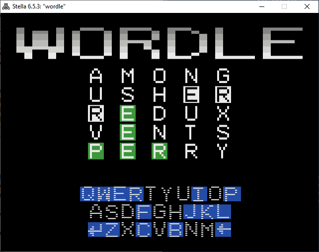

# VCS-Dle
Download the ROM [here](https://github.com/akumanatt/2600-wordle/releases/download/v1.0.0/wordle.bin)!



This is a clone of a hit game
[Wordle](https://www.nytimes.com/games/wordle/index.html) for Atari 2600 video
game console. It was made mainly as a challenge and a curiosity on what is the
most limited platform that could run this simple game. For a quick refresher,
released in 1977, this system has:

- 1.19 MHz 6502-based 8-bit CPU, only 76 cycles per scan-line
- Only 4 KiB of address space available for banked ROM 
- Only 128 bytes (yes, no prefixes) of RAM for variables and stack
- No frame buffer or tile maps, the CPU has to drive graphics line-by-line
  on software
- Only one timer source, no any kind of interrupts at all

## Features

- All of gameplay from the original game, including hard mode
- Switchable color scheme between yellow/white and white/green through BW/Color
  console switch
- Timer for how long you've been keeping the streak
- Sound effects!

## Limitations

- No sharing
- Only 5378 words out of original 13k are valid, since I really want to fit
  this under 16K for extra bragging points
- Not all edge cases for wrong spot letters are handled, specifically those
  that are repeated to the right
- No detailed statistics such as Win % or guess distribution
- Only not-in-word letters are marked on the keyboard, due to hardware
  limitations
- Only NTSC build for now, although colors are chosen to be compatible with PAL
  too

## Controls
Both controller ports are accepted and treated as a single one

- Up, Down, Left, Right - Move cursor around the virtual keyboard
- Fire - Push the selected keyboard button
- Select - Select between easy mode and hard mode, only works on the first
  guess just like the original game
- Reset - Opens a `GIVE UP?` prompt, push again to immediately lose the current
  game
- BW/Color switch - Switch between color schemes as described above, only
  effective in the next game

## Building
[64tass](https://sourceforge.net/projects/tass64/) is required to assemble
source files and build the ROM. Grab it and then run this in a command line:

```
64tass -C -a -b -o wordle.bin src/main.asm
```

Additionally, there are two Python 3 scripts that generate graphics binary and
word list. Although not all source files for them are supplied.
